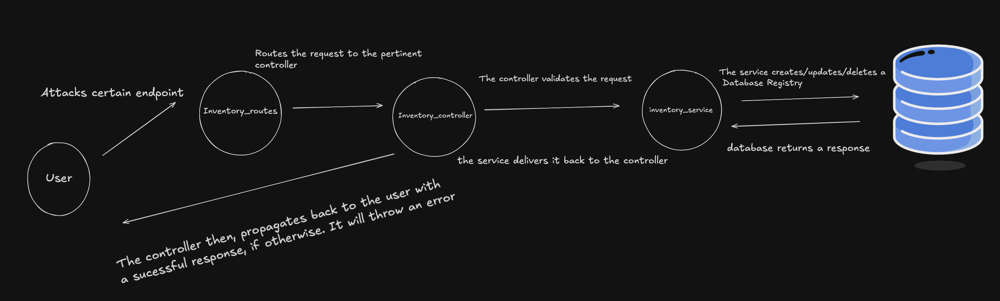

# 📦 Inventory Manager (Flask + Jinja + Docker)

Este proyecto es una aplicación web básica de inventario construida con:

- 🐍 **Python 3.13**
- ⚙️ **Flask** (web framework)
- 🎨 **Jinja2** (templating engine)
- 🐬 **MySQL** (base de datos relacional)
- 🐳 **Docker + Docker Compose** (para el entorno de ejecución)

---

## 🚀 Cómo ejecutar el proyecto

### 1. Clona el repositorio

```bash
git clone https://github.com/lukkaku12/technical-assessment.git
cd technical-assessment
```

### 2. Crea un archivo `.env`

Debes crear un archivo `.env` en la raíz del proyecto con las credenciales de conexión:

```
host=db
port=3306
user=root
password=clave123
dbname=mi_basedatos
```

> ⚠️ Estas credenciales deben coincidir con las definidas en el servicio `db` de `docker-compose.yml`.

---

### 3. Levanta el entorno

Ejecuta el siguiente comando para levantar la app y la base de datos:

```bash
docker-compose up --build -d
```

La app estará disponible en:  
📍 http://localhost:4000

---

## 📂 Estructura del proyecto

```
.
├── app/
│   ├── controllers/
│   ├── models/
│   ├── routes/
│   ├── services/
│   └── templates/
├── config/
│   └── settings.py
├── Dockerfile
├── docker-compose.yml
├── requirements.txt
└── main.py
```

---

## 📌 Endpoints disponibles

### `GET /inventory/add`
Muestra el formulario para crear un nuevo ítem.

### `POST /inventory/`
Crea un nuevo ítem a partir del formulario.

### `GET /inventory/`
Lista todos los ítems del inventario.

### `GET /inventory/edit/<item_id>`
Muestra el formulario de edición para un ítem específico.

### `POST /inventory/<item_id>`
Actualiza el ítem especificado.

### `DELETE /inventory/delete/<item_id>`
Elimina el ítem especificado del inventario.

---

## 🧪 Testing local sin Docker

Si quieres correr el proyecto sin Docker:

```bash
python -m venv .venv
source .venv/bin/activate
pip install -r requirements.txt
python main.py
```

> Asegúrate de tener un servidor MySQL corriendo con las mismas credenciales del `.env`


## Deployments

He deplegado la aplicación en Render para facilidad si no se desea seguir los pasos anteriores aqui:

https://technical-assessment-scwc.onrender.com

## Diagrama de flujo

Una abstracción de todo el ciclo de la petición del usuario hasta la respuesta al mismo.

